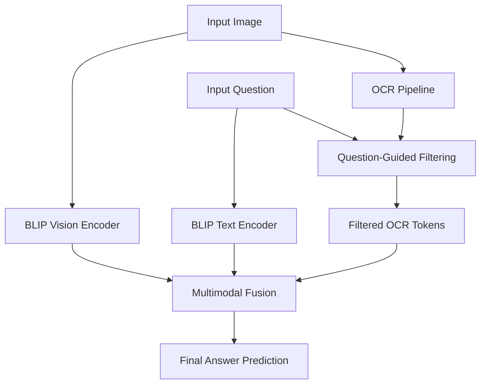

# Text-Aware Visual Question Answering System

This project implements a lightweight, text-aware VQA system that combines visual features with OCR-extracted text to answer natural language questions about images.

## Project Overview

Traditional VQA models often struggle with images containing rich textual information (e.g., signboards, labels, documents). This system addresses the gap by integrating:
1.  **OCR Pipeline**: Uses `EasyOCR` with custom image preprocessing (Grayscale, Gaussian Blur, Otsu's Thresholding) for robust text extraction.
2.  **Multimodal Understanding**: Leverages the `BLIP` (Bootstrapping Language-Image Pre-training) model from Salesforce for joint image and question encoding.
3.  **Question-Guided Filtering**: A novel semantic filtering module that selects OCR tokens relevant to the input question, reducing noise during fusion.
4.  **Multimodal Fusion**: A weighted fusion strategy combining visual semantics, question embeddings, and filtered OCR text.

## Architecture



## Setup & Installation

1.  **Clone the Repository**:
    ```bash
    git clone https://github.com/SricharanAsr/Text-Aware-Visual-Question-Answering-System-Using-OCR-and-Multimodal-Fusion.git
    cd Text-Aware-Visual-Question-Answering-System-Using-OCR-and-Multimodal-Fusion
    ```

2.  **Install Dependencies**:
    ```bash
    pip install -r requirements.txt
    ```

3.  **Run the System**:
    Make sure you are in the project root directory (`Development/`), then run:
    ```bash
    python main.py --image data/test_signboard.png --question "What percentage is the sale?"
    ```

## Phase 2 Progress
- [x] OCR pipeline setup (EasyOCR)
- [x] BLIP model setup (HuggingFace)
- [x] Initial testing (image + question input)
- [x] Basic VQA output generation
- [x] Integration planning (OCR + BLIP)

*This project is being developed for Panel Review-2 (2025-26).*
